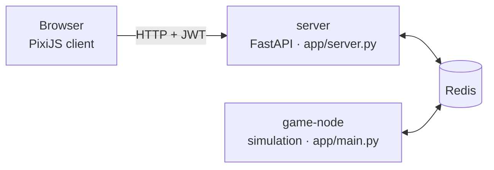

# Pymageddon

**A free-to-play, browser-based MMO survival game where you can program your creature in Python.**

Play now: **<https://pymageddon.ai-mmo-games.de>**

Pymageddon simulates a living ecosystem with real predator-prey dynamics. Plants spread, herbivores graze, and predators hunt. Every creature needs food to survive, so populations rise and crash the way they do in nature. The world only supports as many predators as it can feed.

You can play in two ways:

- **Play live.** Steer a creature with the arrow keys or the on-screen joystick, eat to stay alive, reproduce, and climb the leaderboard.
- **Write a bot.** Deploy a short program in a sandboxed subset of Python. It runs every tick to decide what your creature does. Watch it in spectator mode as your bot family competes with other players' bots.

| | |
|---|---|
| Species explorer | <https://pymageddon.ai-mmo-games.de/explorer> |
| Live world map | <https://pymageddon.ai-mmo-games.de/world_map> |
| Leaderboard | <https://pymageddon.ai-mmo-games.de/players> |
| Bot editor | <https://pymageddon.ai-mmo-games.de/create_bot_page> |
| API docs (OpenAPI) | <https://pymageddon.ai-mmo-games.de/docs> |
| Guide for AI agents | <https://pymageddon.ai-mmo-games.de/llms.txt> |

## Architecture



| Component | Path | Role |
|---|---|---|
| Web/API server | [app/server.py](app/server.py) | FastAPI app. Handles HTML pages, auth (JWT), player input, map snapshots, and SEO/discovery files. |
| Game node | [app/main.py](app/main.py), [app/run.py](app/run.py) | Simulation loop (about 0.33 s per epoch): think → effects → moves → ecosystem rebalance. Writes per-player map views and stats to Redis. |
| Object types | [app/type_defs/objects/](app/type_defs/objects/) | Animals, plants and inanimate objects. New species are data in [wildlife_specs.py](app/type_defs/objects/wildlife_specs.py). |
| Effects | [app/type_defs/objects/effects/](app/type_defs/objects/effects/) | Eating, laying eggs, hatching/turning into other objects, HP depletion, and more. |
| Ecosystem | [app/common_utils/ecosystem.py](app/common_utils/ecosystem.py) | Food web (`DIETS`), species grouping, census, and population regulation. |
| Bot sandbox | [app/sandboxed_language/](app/sandboxed_language/) | AST-based interpreter for bot code. |
| Templates / static | [app/templates/](app/templates/), [app/static/](app/static/) | Jinja2 pages, the game client, and sprites. |
| Sprite pipeline | [app/common_utils/generate_object_sprites.py](app/common_utils/generate_object_sprites.py) | Generates sprites with ComfyUI. Prompts and seeds are recorded in `images/generated_sprites/manifest.json`. |
| Particle FX pipeline | [app/common_utils/generate_particle_fx.py](app/common_utils/generate_particle_fx.py) | Animates effects with ComfyUI image-to-video and packs them into additive flipbook sheets in `app/static/particles/fx/`. |
| Website art pipeline | [app/common_utils/generate_website_art.py](app/common_utils/generate_website_art.py) | Uses actual game sprites as Wan I2V references for website illustrations and badges. Records prompts, seeds and selected frames in the sprite manifest. |

To regenerate website art with ComfyUI on `localhost:8080`, run from `app/`:

```sh
../.venv/bin/python -m common_utils.generate_website_art --dry-run
../.venv/bin/python -m common_utils.generate_website_art
```

Review the contact sheets in `/tmp/pymageddon_website` before publishing a generated
frame (frame 0 is the input, not new art):

```sh
../.venv/bin/python -m common_utils.generate_website_art --publish --frame 9
```

Use `--only chase`, `--only cow_badge` or `--only family` to work on one composition.
Use a fresh `--raw-dir` to regenerate instead of reusing cached clips. Website art
is published as still JPEG/PNG images, with transparent circular badge edges;
the UI does not auto-play video. Bump the image URL cache version in the templates
after publishing replacements. The 17-frame clips use 512px for the illustration
and 384px for badges to fit the generation server's GPU memory.
For the chase illustration, publishing preserves the sprite-composed meadow
outside feathered vehicle masks, avoiding I2V foliage and path-edge artifacts.
The current reviewed selections are frame 2 for the chase and frame 9 for badges.

### Timing and client sync

The game client in [app/templates/play.html](app/templates/play.html) never runs the simulation. It polls snapshots over HTTP and animates between them. These are the moving parts:

1. **Server tick.** The game node advances one epoch every `realm.TIME_INTERVAL` (about 0.33 s; see `main_loop` in [main.py](app/main.py)). After each epoch, `send_map_data` writes `map_{player}` to Redis (expires after 5 s). The snapshot includes `global_params.epoch`, `time_interval` and `new_map_timestamp`.
2. **Polling.** `pollServer()` runs a self-scheduling `setTimeout` loop with one request in flight at a time. It calls `GET /get_map?since_epoch=<last epoch>`. If the map is still `running` at that epoch, the server answers `204` with an empty body. Otherwise it returns the full snapshot. After a new epoch arrives, the client waits `0.6 × time_interval`, then polls every 25 ms until the next epoch. While not running, it polls every 500 ms.
3. **Compression.** `GZipMiddleware` (responses of 1 KB or more) compresses snapshots, which mostly consist of the view's tiles. Bandwidth matters most when playing from another device on the network.
4. **Interpolation.** Each sprite (`MyObject`) moves from (`x`, `y`) to (`x_new`, `y_new`) with `t = elapsed / map.refresh_time`, clamped to `[0, 1]`. When a snapshot arrives, `update_data()` starts the new segment from the **current on-screen position**, `lerp(x, x_new, last_t)`. Early or late snapshots therefore never make sprites snap. The camera follows the player sprite's interpolated position.
5. **Adaptive duration.** `refresh_data()` keeps an exponential moving average of the actual time between epoch arrivals: weight 0.2, each sample clamped to `[0.5, 2] × time_interval`. It sets `refresh_time = 1.1 × EMA`, clamped to `[0.9, 1.6] × time_interval`. Network jitter then stretches motion slightly instead of freezing it.
6. **Input.** Key changes go to `POST /control` immediately, with at most one request in flight. A newer key state is queued and replaces the older one. While a key is held, the state is also resent every 200 ms. The game node reads `control_{player}` on its next tick.

## Running locally

### With Docker Compose (recommended)

```bash
docker compose up --build
# open http://localhost  (set SERVER_PORT=8000 to use another port)
```

This starts Redis, the web server and the game node. The server and game node connect to Redis at the hostname `pymageddon-redis-server`.

### Without Docker

Requires Python 3.12 and a Redis instance reachable as `pymageddon-redis-server`. For example, add `127.0.0.1 pymageddon-redis-server` to `/etc/hosts`.

```bash
python -m venv .venv
.venv/bin/pip install -r app/requirements.txt
docker run --rm -p 6379:6379 redis   # or any local Redis

cd app
../.venv/bin/python run.py &                       # game node
../.venv/bin/uvicorn server:app --port 8000        # web server
```

The game-node image compiles `app/` with Cython (`python setup.py build_ext --inplace`) for speed. Avoid this locally: the compiled `.so` files take precedence over your `.py` edits.

## Writing a bot

Bot code is evaluated once per tick. Set `intent` to one of the following values:

- `"MOVE_FORWARD"`
- `"ROTATE_UP"`
- `"ROTATE_RIGHT"`
- `"ROTATE_DOWN"`
- `"ROTATE_LEFT"`

If you leave `intent` as `None`, the creature idles.

```python
global steps
if not steps:
    steps = 0
steps = steps + 1
me = parent_object                      # {"x", "y", "rotation"}
target = find_nearest_xy(me["x"], me["y"], "Grass")
intent = "MOVE_FORWARD"
if target:
    if target["x"] > me["x"]:
        want = "RIGHT"
    elif target["x"] < me["x"]:
        want = "LEFT"
    elif target["y"] < me["y"]:
        want = "UP"
    else:
        want = "DOWN"
    if me["rotation"] != want:
        intent = "ROTATE_" + want
elif steps % 5 == 0:
    intent = random_choice(["ROTATE_UP", "ROTATE_RIGHT", "ROTATE_DOWN", "ROTATE_LEFT"])
```

| Available | Notes |
|---|---|
| Syntax | Assignments, `if`/`elif`/`else`, `global`, arithmetic, comparisons, `and`/`or`/`not`, `in`, list/tuple/dict literals, indexing. No loops, imports, attribute access or `def`. Limited to 1000 steps per tick. |
| `parent_object` | Your creature: `{"x", "y", "rotation"}`. The y axis points down. |
| `find_nearest_xy(x, y, type, rad=10)` | Nearest object of a type name (or list of names) as `{"x", "y", "rotation"}`, or `None`. |
| `random_randint(a, b)`, `random_choice(seq)` | Randomness. |
| `get_index(seq, i)`, `set_index(seq, i, v)` | List access helpers. |

Notes:

- All variables persist between ticks. Declare a variable with `global` before reading it, which initializes it to `None` on the first tick.
- `and` and `or` evaluate both sides, so nest `if` statements when the right side depends on the left.
- Any runtime error resets the bot's variables.

Deploy from the [bot editor](https://pymageddon.ai-mmo-games.de/create_bot_page) or through the API:

```bash
TOKEN=$(curl -s -X POST https://pymageddon.ai-mmo-games.de/token \
  -H 'Content-Type: application/json' -d '{"is_guest": true}' | jq -r .access_token)

curl -X POST https://pymageddon.ai-mmo-games.de/create_bot \
  -H "Authorization: Bearer $TOKEN" -H 'Content-Type: application/json' \
  -d '{"code_str": "intent = \"MOVE_FORWARD\""}'

curl -H "Authorization: Bearer $TOKEN" https://pymageddon.ai-mmo-games.de/get_map
```

More examples are in [app/sandboxed_language/test_codes/](app/sandboxed_language/test_codes/).

## HTTP API

The live OpenAPI schema is at `/openapi.json`, and Swagger UI is at `/docs`.

| Method | Path | Auth | Purpose |
|---|---|---|---|
| POST | `/token` | – | Log in (`username`, `password`) or create a guest (`is_guest: true`). Returns a bearer token. |
| POST | `/create_player` | – | Register (`username`, `password`, `verify_password`). |
| POST | `/new_game` | ✓ | Join as a player, or spectate (`spectator_follow_index`, `spectator_follow_type`). |
| POST | `/create_bot` | ✓ | Deploy bot code (`code_str`) and spectate it. |
| POST | `/control` | ✓ | Held keys: `ArrowUp`, `ArrowDown`, `ArrowLeft`, `ArrowRight` (booleans). |
| GET | `/get_map` | ✓ | Current view: `global_params`, `player`, `objects`, `tiles`, `particles`. With `?since_epoch=N`, it returns `204` while the map is still at epoch `N`. |
| GET | `/score` | ✓ | Your player and family scores and ranks. |
| POST | `/end_game` | ✓ | Leave the game. |
| GET | `/me` | ✓ | Authenticated username. |
| GET | `/map_image.png`, `/hist_counts_image.png` | – | Live world map image and population history chart. |
| GET | `/player_image/{name}` | – | Deterministic SVG avatar. |

### Discovery and SEO endpoints

| Path | Purpose |
|---|---|
| `/robots.txt` | Crawl rules. Points to the sitemap and `llms.txt`. |
| `/sitemap.xml` | All public pages, including one page per species. |
| `/llms.txt` | Markdown overview for LLMs and agents ([llmstxt.org](https://llmstxt.org)): pages, species, API and the bot language. |
| `/openapi.json`, `/docs` | Machine-readable and interactive API description. |

The HTML pages also include canonical URLs, Open Graph and Twitter Card tags, and schema.org `VideoGame` JSON-LD on the home page. They link to `/llms.txt` and `/openapi.json` with `<link rel="alternate">` and `<link rel="service-desc">`.

## Development

```bash
.venv/bin/python -m pytest -q                       # unit tests + ~25 s ecosystem simulation
.venv/bin/python -m pytest -q simulation_tests/     # long-running equilibrium checks
pre-commit run --all-files                          # isort, black, flake8
```

The frontend JavaScript tests in [tests/frontend/](tests/frontend/) run through `node --test`, which is invoked from pytest.

To add or rebalance species, follow [.github/skills/add-game-objects/SKILL.md](.github/skills/add-game-objects/SKILL.md). Contributor and agent conventions are in [AGENTS.md](AGENTS.md).

## Deployment

Pushing to `master` runs [.github/workflows/cicd-prod.yml](.github/workflows/cicd-prod.yml), which runs the pre-commit checks and then builds and deploys the Docker images in [docker_images/](docker_images/).
